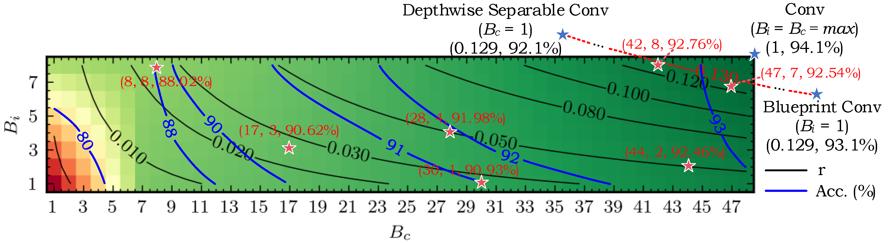
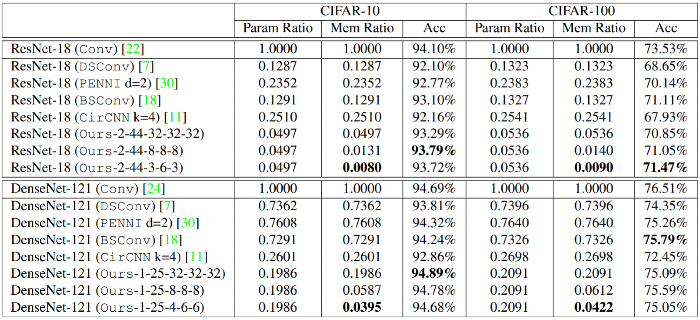

# Memory-Efficient Multi-Level In-Situ Generation (MLG)

By [Jiaqi Gu](https://github.com/JeremieMelo), [Hanqing Zhu](https://github.com/zhuhanqing), [Chenghao Feng](https://github.com/Fengchenghao1996), Mingjie Liu, [Zixuan Jiang](https://github.com/zixuanjiang), Ray T. Chen and David Z. Pan.

This repo is the official implementation of "[Towards Memory-Efficient Neural Networks via Multi-Level in situ Generation](https://arxiv.org/abs/2108.11430)".

# Introduction
**MLG** is a general and unified framework to trade expensive memory transactions with ultra-fast on-chip computations, directly translating to performance improvement.
**MLG** explores the intrinsic correlations and bit-level redundancy within DNN kernels and propose a multi-level in situ generation mechanism with mixed-precision bases to achieve on-the-fly recovery of high-resolution parameters with minimum hardware overhead.
**MLG** can boost the memory efficiency by 10-20× with comparable accuracy over four state-of-theart designs, when benchmarked on ResNet-18/DenseNet121/MobileNetV2/V3 with various tasks


We explore intra-kernel and cross-kernel correlation in the accuracy (blue curve) and memory compression ratio (black curve) space with ResNet18/CIFAR-10.
Our method generalizes prior DSConv and Blueprint Conv with better efficiency-performance trade-off.


On CIFAR-10/100 and ResNet-18/DenseNet-121, we surpass prior low-rank methods with 10-20x less weight storage cost.

# Dependencies
* Python >= 3.6
* pyutils >= 0.0.1. See [pyutils](https://github.com/JeremieMelo/pyutility) for installation.
* pytorch-onn >= 0.0.2. See [pytorch-onn](https://github.com/JeremieMelo/pytorch-onn) for installation.
* Python libraries listed in `requirements.txt`
* NVIDIA GPUs and CUDA >= 10.2

# Structures
* core/
    * models/
        * layers/
            * mlg_conv2d and mlg_linear: MLG layer definition
        * resnet.py: MLG-based ResNet definition
        * model_base.py: base model definition with all model utilities
    * builder.py: build training utilities
* configs: YAML-based config files
* scripts/: contains experiment scripts
* train.py: training logic

# Usage
* Pretrain teacher model.\
`> python3 train.py configs/cifar10/resnet18/train/pretrain.yml`

* Train MLG-based student model with L2-norm-based projection, knowledge distillation, multi-level orthonormality regularization, (Ci, Co, qb, qu, qv) = (2, 44, 3, 6, 3).\
`> python3 train.py configs/cifar10/resnet18/train/train.yml --teacher.checkpoint=path-to-teacher-ckpt --mlg.projection_alg=train --mlg.kd=1 --mlg.base_in=2 --mlg.base_out=44 --mlg.basis_bit=3 --mlg.coeff_in_bit=6 --mlg.coeff_out_bit=3 --criterion.ortho_weight_loss=0.05`

* Scripts for experiments are in `./scripts`. For example, to run teacher model pretraining, you can write proper task setting in SCRIPT=`scripts/cifar10/resnet18/pretrain.py` and run\
`> python3 SCRIPT`

* To train ML-based student model with KD and projection, you can write proper task setting in SCRIPT=`scripts/cifar10/resnet18/train.py` (need to provide the pretrained teacher checkpoint) and run\
`> python3 SCRIPT`

# Citing Memory-Efficient Multi-Level In-Situ Generation (MLG)
```
@inproceedings{gu2021MLG,
  title={Towards Memory-Efficient Neural Networks via Multi-Level in situ Generation},
  author={Jiaqi Gu and Hanqing Zhu and Chenghao Feng and Mingjie Liu and Zixuan Jiang and Ray T. Chen and David Z. Pan},
  journal={International Conference on Computer Vision (ICCV)},
  year={2021}
}
```

# Related Papers
* Jiaqi Gu, Hanqing Zhu, Chenghao Feng, Mingjie Liu, Zixuan Jiang, Ray T. Chen, David Z. Pan, "Towards Memory-Efficient Neural Networks via Multi-Level in situ Generation," ICCV, 2021. \[[paper](https://arxiv.org/abs/2108.11430) \| [slides](https://jeremiemelo.github.io/publications/papers/ML_ICCV2021_Gu_poster.pdf)\]
